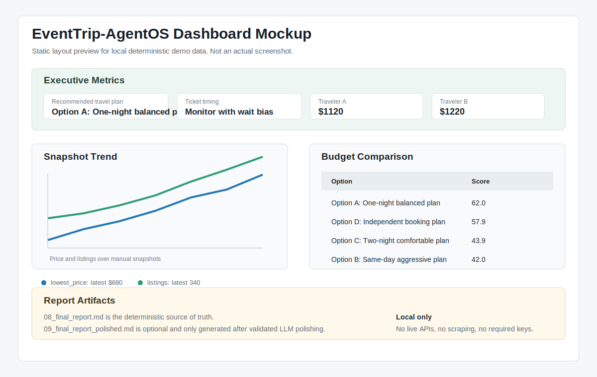

# EventTrip-AgentOS

MCP-style, skill-based, file-memory multi-agent planning for collaborative event travel under market uncertainty.

**Tagline:** collaborative event travel decision support with anti-scalper ticket timing, Markdown memory, and MCP-compatible tools.

**Version:** v0.1.0
**Status:** Portfolio prototype / deterministic demo

EventTrip-AgentOS is a deterministic prototype for budget-first event-trip decision support. It coordinates specialized agents through Markdown shared memory, uses mock MCP-style tools, tracks manual market snapshots, and produces a final Markdown report that explains ticket timing, flight tradeoffs, hotel value, market pressure, AA cost splitting, trend signals, and travel risk.

The default demo is deterministic, offline, and does not call paid APIs. It does not require API keys and does not scrape websites.

## Project Highlights

- Multi-agent orchestration for ticket, flight, hotel, market, budget, risk, and report agents.
- Markdown shared memory with YAML frontmatter for transparent agent handoffs.
- MCP server wrapper with official MCP client validation.
- Official-first ticket link recommendations without checkout automation.
- Manual market snapshot tracker for price/listing trend analysis.
- Combined ticket timing stance: single-day monitor + trend wait => Monitor with wait bias.
- Safe snapshot CLI with `--dry-run` and explicit `--overwrite`.
- Optional OhMyGPT polishing with deterministic protected metadata repair.
- Local Streamlit dashboard for snapshot and recommendation review.
- Deterministic offline tests; no live APIs, scraping, or required API keys.

## Quick Demo

Run the main demo from Windows PowerShell:

```powershell
conda activate eventtrip_mcp
cd D:\others\Eventrip_agentos
python -m eventtrip.orchestrator --demo portugal_dr_congo_houston
```

Expected summary:

```text
Recommended option: Option A: One-night balanced plan
Traveler A: $1120
Traveler B: $1220
Ticket timing recommendation: Monitor with wait bias
```

## Quickstart

Recommended Phase 3 workflow from Windows PowerShell:

```powershell
conda activate eventtrip_mcp
cd D:\others\Eventrip_agentos
pip install -r requirements.txt
python -m eventtrip.orchestrator --demo portugal_dr_congo_houston
python scripts\validate_mcp_client.py
pytest
```

Legacy core-demo workflow:

```powershell
conda activate smiley_bot
cd D:\others\Eventrip_agentos
pip install -r requirements.txt
python -m eventtrip.orchestrator --demo portugal_dr_congo_houston
pytest
```

## Requirements

- Python 3.9+ for the core Phase 1 demo where practical
- Python 3.11 recommended for Phase 3+ development and official MCP workflows
- Conda recommended
- Primary Phase 3 environment: `eventtrip_mcp` with Python 3.11.15
- Legacy/core compatibility environment: `smiley_bot` with Python 3.9.23

Phase 1 core demo remains compatible with Python 3.9+. Phase 3+ development and official MCP workflows are recommended on Python 3.11 using the `eventtrip_mcp` environment.

## Documentation

- [Architecture](docs/architecture.md)
- [MCP Validation](docs/mcp_validation.md)
- [Roadmap](docs/roadmap.md)
- [Demo Walkthrough](docs/demo_walkthrough.md)
- [Project Summary](docs/project_summary.md)
- [Dashboard Guide](docs/dashboard_guide.md)
- [API Adapter Design](docs/api_adapter_design.md)
- [Web Collection Layer](docs/web_collection.md)
- [Ticket Link Recommendations](docs/ticket_links.md)
- [Release v0.1.0 Draft](docs/release_v0_1_0.md)
- [Verified MCP client output](examples/mcp_client_validation_output.txt)
- [Changelog](CHANGELOG.md)
- [License](LICENSE)

## Portfolio Summary

This project demonstrates a practical agent architecture rather than a generic chatbot wrapper: deterministic tools, Markdown memory, MCP validation, trend-based ticket timing, and clear report generation are all visible in the repository.

## Why This Project Exists

Most travel-agent demos generate generic itineraries. Real event travel often depends on harder decisions: when to buy tickets, whether visible scarcity is real, how to split shared costs, and whether a cheap plan creates too much risk.

This project focuses on collaborative event travel planning under market uncertainty.

## Demo Scenario

The first demo plans one match only:

- Match: Portugal vs DR Congo
- Date: June 17, 2026
- Venue: NRG Stadium / Houston Stadium
- City: Houston, Texas
- Traveler A origin: Pittsburgh, PA (PIT)
- Traveler B origin: Seattle, WA (SEA)

Germany vs Curacao is intentionally excluded from this demo.

## Architecture

```text
User Request
   |
   v
Orchestrator
   |
   v
Markdown Shared Memory / File Bus
   |
   v
Ticket Agent -> Ticket Link Agent -> Flight Agent -> Hotel Agent -> Snapshot Agent -> Market Agent -> Budget Agent -> Risk Agent -> Report Agent
   |
   v
Final Markdown Report
```

## Demo Output

Each run creates a timestamped directory:

```text
runs\portugal_dr_congo_houston_demo_YYYYMMDD_HHMMSS\
```

The final report is written to:

```text
runs\portugal_dr_congo_houston_demo_YYYYMMDD_HHMMSS\08_final_report.md
```

This internal planning report includes deterministic estimates plus a clearly labeled source-backed citation summary and evidence traceability matrix for public context. Claims without registered public sources are marked directly as not source-backed instead of being filled with unsupported numbers.

The source-backed public report is written to:

```text
runs\portugal_dr_congo_houston_demo_YYYYMMDD_HHMMSS\10_source_backed_final_report.md
```

Use `10_source_backed_final_report.md` for public sharing when you want only official/news/web-backed statements. It intentionally excludes unsourced flight, hotel, ticket, and total budget estimates.

The source-backed report includes `What To Do Next`, `Recommended Official Purchase Paths`, and `What Is Still Unknown` sections so users can act on official links while seeing exactly which values are not publicly sourced yet.

Print or open the latest source-backed report:

```powershell
python -m eventtrip.source_report_cli latest
python -m eventtrip.source_report_cli latest --open
```

Example CLI summary:

```text
Final report: runs\portugal_dr_congo_houston_demo_YYYYMMDD_HHMMSS\08_final_report.md
Recommended option: Option A: One-night balanced plan
Estimated cost per traveler:
  Traveler A: $1120
  Traveler B: $1220
Ticket timing recommendation: Monitor with wait bias
```

## MCP-Style Tools

Phase 1 implements pure Python functions in `eventtrip/mcp_server/tools.py`. They look like MCP tools but use local mock data:

- `get_ticket_market`
- `get_ticket_links`
- `recommend_ticket_links`
- `get_flight_quotes`
- `get_hotel_quotes`
- `get_market_signals`
- `compute_aa_split`
- `compute_scalper_stress_index`
- `rank_budget_options`
- `get_market_snapshots`
- `analyze_market_snapshots`
- `append_market_snapshot`
- `preview_snapshot_import`
- `preview_web_evidence_from_text`
- `preview_web_evidence_from_local_file`

Phase 2 exposes these same functions through a real MCP server without changing the agent contract. Phase 3 adds deterministic market snapshot tools backed by local CSV data. Phase 7 adds preview-only web evidence extraction tools.

## Phase 2: MCP Server

Phase 2 exposes the existing mock tools through a real MCP server wrapper. Phase 3 adds market snapshot tools to the same MCP surface. The default multi-agent demo still runs offline without MCP, and the existing agents continue to call local Python functions directly.

The MCP server is local and stdio-based by default. It does not start a public network service, does not call live travel APIs, does not scrape websites, and does not require secrets. All tools are deterministic and backed by mock data.

The official MCP Python SDK currently requires Python 3.10+. The core EventTrip-AgentOS demo remains Python 3.9+ and is tested in `smiley_bot` with Python 3.9.23. In Python 3.10+ with the `mcp` package installed, the server uses FastMCP. In Python 3.9, the same command starts a minimal stdio JSON-RPC fallback so local tool metadata and calls remain testable.

Run the server from Windows PowerShell:

```powershell
conda activate eventtrip_mcp
cd D:\others\Eventrip_agentos
pip install -r requirements.txt
python -m eventtrip.mcp_server.server
```

Use a Python 3.10+ environment for full official SDK-based MCP client integration.

Exposed MCP tools:

- `get_ticket_market`
- `get_ticket_links`
- `recommend_ticket_links`
- `get_flight_quotes`
- `get_hotel_quotes`
- `get_market_signals`
- `compute_aa_split`
- `compute_scalper_stress_index`
- `rank_budget_options`
- `get_market_snapshots`
- `analyze_market_snapshots`
- `append_market_snapshot`
- `preview_snapshot_import`
- `preview_web_evidence_from_text`
- `preview_web_evidence_from_local_file`

Example local MCP client config:

```text
examples/mcp_client_config.example.json
```

Detailed MCP validation notes are in `docs/mcp_validation.md`.

## Phase 2.1: MCP Client Validation

The normal Phase 1 demo still works in Python 3.9. Full official MCP client validation requires Python 3.10+ because the official MCP Python SDK requires Python 3.10+.

Recommended separate validation environment:

```powershell
conda create -n eventtrip_mcp python=3.11 -y
conda activate eventtrip_mcp
cd D:\others\Eventrip_agentos
pip install -r requirements.txt
python scripts\validate_mcp_client.py
```

`requirements.txt` includes `mcp; python_version >= "3.10"`, so Python 3.11 installs the official MCP SDK automatically.

The validation script starts the local MCP server over stdio, lists tools, and calls deterministic mock tools including `get_ticket_market`, `compute_scalper_stress_index`, `get_hotel_quotes`, `get_market_snapshots`, and `analyze_market_snapshots`.

This validation does not use live APIs, paid APIs, web scraping, OhMyGPT, or secrets.

## Verified MCP Client Validation

The core demo remains compatible with Python 3.9+. Official MCP SDK validation was tested in a separate Python 3.11 environment named `eventtrip_mcp`.

The validation script confirms that an MCP-compatible client can start the local server over stdio, list the deterministic mock tools, and call selected tools through MCP.

Sample output:

```text
examples/mcp_client_validation_output.txt
```

Reproduce the validation:

```powershell
conda create -n eventtrip_mcp python=3.11 -y
conda activate eventtrip_mcp
cd D:\others\Eventrip_agentos
pip install -r requirements.txt
python scripts\validate_mcp_client.py
```

No live APIs are used. No OhMyGPT API key is required. No web scraping is used. The official MCP SDK path requires Python 3.10+.

## Phase 3: Market Snapshot Tracker

Phase 3 extends the demo from a single mock market reading into a deterministic market snapshot workflow.

Users can manually log ticket-market snapshots in CSV. Each snapshot can include ticket price, listings, Category 3 range, hotel availability proxy, flight price pressure, social buzz, days before event, source type, and notes. SnapshotAgent analyzes the time series and adds trend-based ticket timing to the final report.

The final report fuses the single-day MarketAgent signal with the multi-snapshot trend signal. In the seed demo, that produces the overall ticket timing stance: Monitor with wait bias.

Seed data lives at:

```text
data\market_snapshots\portugal_dr_congo_snapshots.csv
```

Example CSV row:

```csv
2026-05-15,portugal_dr_congo,680,340,400,750,0.52,0.52,0.86,33,mock_manual,"Reseller pressure may be increasing."
```

Run the Phase 3 workflow:

```powershell
conda activate eventtrip_mcp
cd D:\others\Eventrip_agentos
python -m eventtrip.orchestrator --demo portugal_dr_congo_houston
```

This avoids scraping, keeps the system deterministic, and prepares clean provider interfaces for future live integrations.

## Manual Snapshot CLI

Use the manual snapshot CLI to analyze or append local CSV snapshots without editing files by hand.

```powershell
conda activate eventtrip_mcp
cd D:\others\Eventrip_agentos
python -m eventtrip.snapshots_cli analyze --match portugal_dr_congo
python -m eventtrip.snapshots_cli append --match portugal_dr_congo --snapshot-date 2026-05-22 --lowest-price 650 --listings 360 --category-3-low 400 --category-3-high 750 --hotel-availability-score 0.50 --flight-price-pressure 0.55 --social-buzz-score 0.86 --days-before-event 26 --source-type manual --notes "Manual check" --dry-run
```

Use `--dry-run` before writing. Use `--overwrite` only when intentionally replacing an existing snapshot for the same match/date. The CLI uses manual data only; it does not call live APIs, scrape websites, or require OhMyGPT.

Detailed walkthrough: [Demo Walkthrough](docs/demo_walkthrough.md).

## Phase 5: Local Dashboard

Phase 5 adds a local-only Streamlit dashboard for portfolio demos. It visualizes manual snapshot history, trend analysis, deterministic budget recommendations, and latest generated report paths. It does not call live APIs, scrape websites, or require OhMyGPT.

```powershell
conda activate eventtrip_mcp
cd D:\others\Eventrip_agentos
pip install -r requirements.txt
streamlit run app\streamlit_app.py
```

The dashboard is presentation-only. The CLI and deterministic Markdown report remain the source-of-truth workflow.

See [Dashboard Guide](docs/dashboard_guide.md) for screenshot instructions and review notes.

## Dashboard Preview



This is a static mockup asset, not a live screenshot. The local Streamlit page title is `EventTrip-AgentOS Dashboard`, and the dashboard can be run with `streamlit run app\streamlit_app.py`.

## Snapshot Import

Phase 6 adds a safe local import workflow for external snapshot files. It supports CSV and JSON files with the existing market snapshot schema. This does not call live APIs, does not scrape websites, and does not require secrets.

Use `--dry-run` first:

```powershell
conda activate eventtrip_mcp
cd D:\others\Eventrip_agentos
python -m eventtrip.snapshots_cli import --input examples\external_snapshot_import.csv --match portugal_dr_congo --dry-run
```

To write validated rows into the manual snapshot CSV, run the same command without `--dry-run`. Use `--overwrite` only when intentionally replacing the same match/date rows.

## Release Notes

- [Release v0.1.0 Draft](docs/release_v0_1_0.md)
- [Changelog](CHANGELOG.md)

## API Adapter Design

Phase 6.1 adds disabled-by-default official API provider stubs and a design document for future adapters. No live providers run in the default demo.

- [API Adapter Design](docs/api_adapter_design.md)

## Phase 7: Web Evidence Collection

Phase 7 adds an opt-in web evidence layer for local HTML/text fixtures and explicitly requested single-page public HTTP collection with robots.txt checking. The default demo, tests, dashboard, and MCP validation do not perform live HTTP collection.

Extract local fixture evidence:

```powershell
conda activate eventtrip_mcp
cd D:\others\Eventrip_agentos
python -m eventtrip.web_collect_cli extract --local-path examples\sample_ticket_market_page.html --match portugal_dr_congo
```

The collector does not bypass login, CAPTCHA, paywalls, or access controls. It does not automate purchases and does not write market snapshots directly. See [Web Collection Layer](docs/web_collection.md).

Reviewed evidence can be converted into a manual market snapshot only after explicit human inputs are supplied:

```powershell
python -m eventtrip.evidence_review_cli preview --evidence examples\sample_web_evidence.json
python -m eventtrip.evidence_review_cli convert --evidence examples\sample_web_evidence.json --snapshot-date 2026-05-22 --category-3-low 400 --category-3-high 750 --hotel-availability-score 0.50 --flight-price-pressure 0.55 --social-buzz-score 0.86 --days-before-event 26 --dry-run
```

Use `--save` only after reviewing the candidate values. Duplicate match/date rows still require explicit `--overwrite`.

## Ticket Link Recommendations

EventTrip-AgentOS can recommend official-first ticket navigation links, but it never purchases tickets or automates checkout.

The local registry lives at `data/ticket_links.yaml`. The current policy is:

- Use FIFA official ticketing first.
- Use FIFA official resale/exchange for verified resale inventory.
- Use official FIFA support articles to verify resale policy and risk.
- Treat hospitality as optional premium inventory, not budget-first default.

See [Ticket Link Recommendations](docs/ticket_links.md).

## Source-Backed Public Report

Phase 7.3 adds a source-backed public report generated from `data/source_evidence.yaml`. It uses official FIFA pages and public news sources only. It does not include local planning estimates unless they have a registered public source.

```powershell
python -m eventtrip.orchestrator --demo portugal_dr_congo_houston
```

Then open:

```text
runs\portugal_dr_congo_houston_demo_YYYYMMDD_HHMMSS\10_source_backed_final_report.md
```

The original deterministic `08_final_report.md` remains useful for internal regression tests and planning logic. The source-backed report is the safer public-facing artifact when you want no local placeholder data in the visible report.

## Project Health Check

Run the local health check before pushing larger documentation or release changes:

```powershell
python scripts\project_health_check.py
```

## Skills

Reusable skills live under `eventtrip/skills/*/SKILL.md`:

- Ticket timing
- Hotel value
- AA split rules
- Travel risk
- Market intelligence

They document the reasoning policies that agents apply in deterministic form.

## Markdown Shared Memory

Each run directory acts as a simple file bus. Every agent writes one Markdown file with YAML frontmatter so humans and downstream agents can both read it:

```yaml
---
agent: ticket_agent
status: completed
confidence: medium
created_at: 2026-01-01T12:00:00
next_agent: flight_agent
---
```

Deterministic filenames:

- `00_user_request.md`
- `01_ticket_agent.md`
- `01b_ticket_link_agent.md`
- `02_flight_agent.md`
- `03_hotel_agent.md`
- `04_snapshot_agent.md`
- `05_market_agent.md`
- `06_budget_agent.md`
- `07_risk_agent.md`
- `08_final_report.md`
- `09_final_report_polished.md` only when `--use-llm` succeeds
- `10_source_backed_final_report.md`

## Final Report Contents

- Executive Summary
- Demo Assumptions
- Agent Workflow
- Portugal vs DR Congo Ticket Analysis
- Recommended Ticket Links
- Flight Analysis
- Hotel Analysis
- Market Timing / Anti-Scalper Analysis
- Market Snapshot Trend Analysis
- Budget Comparison Table
- Recommended Plan
- Practical Booking Rules
- Next Actions
- Limitations
- Optional LLM Backend Note

## Optional LLM Report Polishing

The default demo uses deterministic mock outputs. If `--use-llm` is not passed, no LLM API is called and only `08_final_report.md` is generated.

OhMyGPT can be used as an optional OpenAI-compatible LLM backend for report polishing only. The deterministic `08_final_report.md` remains the source of truth. When `--use-llm` is passed and validation succeeds, the system writes a separate presentation artifact: `09_final_report_polished.md`.

The polishing layer validates protected invariants so the LLM cannot silently change source-of-truth values such as costs, recommendations, dates, scores, trigger thresholds, match names, traveler names, and limitations. If validation fails, the deterministic report remains intact and the polished report is not accepted.

Phase 4.2 adds deterministic repair blocks for required limitations and protected decision metadata. This lets polished prose stay user-friendly while preserving machine-readable values such as `monitor_with_wait_bias`.

The project calls the API endpoint, not the OhMyGPT dashboard UI. The dashboard is only for human account management, balance checking, API key creation, and billing.

Copy `.env.example` to `.env` and fill it with `.env` content:

```powershell
Copy-Item .env.example .env
# Edit .env and add OHMYGPT_API_KEY manually. Do not commit .env.
```

```env
OHMYGPT_API_KEY=your_ohmygpt_api_key_here
OHMYGPT_BASE_URL=https://api.ohmygpt.com/v1
OHMYGPT_MODEL=gpt-4o-mini
```

Do not commit `.env`. It is ignored by `.gitignore`.

Then run:

```powershell
conda activate eventtrip_mcp
cd D:\others\Eventrip_agentos
python -m eventtrip.orchestrator --demo portugal_dr_congo_houston --use-llm
```

If `--use-llm` is passed without `OHMYGPT_API_KEY`, the program still generates `08_final_report.md` and prints a clear LLM polishing error. LLM polishing must never change computed numbers, scores, option names, dates, trigger thresholds, limitations, or recommendations.

## How This Differs From Generic Travel Agents

Generic travel agents generate itineraries. EventTrip-AgentOS reasons over ticket markets, hotel and flight demand proxies, shared costs, cancellation risk, and timing uncertainty. It is designed to answer whether the travelers should spend money now, wait, or hold flexible options.

## Repository Structure

```text
.
|-- README.md
|-- AGENTS.md
|-- requirements.txt
|-- .gitignore
|-- .env.example
|-- pyproject.toml
|-- eventtrip/
|   |-- orchestrator.py
|   |-- schemas.py
|   |-- markdown_io.py
|   |-- scoring.py
|   |-- llm_client.py
|   |-- agents/
|   |-- mcp_server/
|   `-- skills/
|-- data/
|   `-- market_snapshots/
|-- runs/
|-- examples/
`-- tests/
```

## Future Roadmap

- Phase 5.3: real dashboard screenshot capture and README media polish
- Phase 6.2: choose one official API candidate and implement behind explicit opt-in config
- Deferred: live APIs by default, web scraping, production dashboard features, forecasting, and generalized event templates

See [Roadmap](docs/roadmap.md) for completed phases and deferred live-integration ideas.
